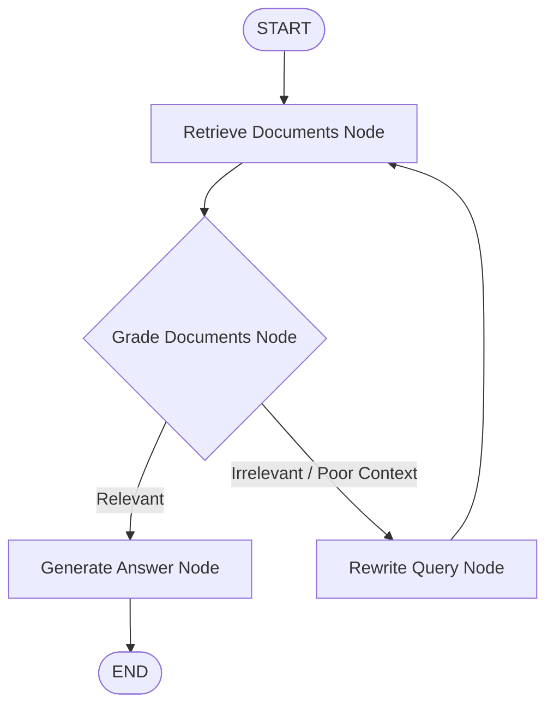

# LangGraph: Stateful Multi-Agent Orchestration Framework

## 1. What is LangGraph?

**LangGraph** is an open-source framework developed by LangChain designed for building **stateful, multi-actor, agentic applications** using Large Language Models (LLMs).

While traditional LLM chains (like standard LangChain LCEL) are linear Directed Acyclic Graphs (DAGs) that execute steps sequentially, real-world autonomous agents require **loops, cycles, state persistence, branching logic, and human-in-the-loop interactions**. LangGraph models application logic as a **state machine graph**.

```text
┌──────────────────────────────────────────────────────────┐
│                      LangGraph State                     │
│  { question: "...", documents: [...], generation: "..." }│
└──────────────┬────────────────────────────▲──────────────┘
               │                            │
               ▼                            │ Updates State
      ┌────────────────┐           ┌────────┴───────┐
      │  Retrieve Node ├──────────►│  Grade Node    │
      └────────────────┘           └────────┬───────┘
                                            │
                                  Conditional Routing
                                  ┌─────────┴─────────┐
                                  ▼                   ▼
                          [Context Relevant]   [Context Irrelevant]
                                  │                   │
                                  ▼                   ▼
                         ┌────────────────┐  ┌─────────────────┐
                         │ Generate Node  │  │ Rewrite Query   │
                         └────────────────┘  └─────────────────┘
```

---

## 2. Core Concepts & Building Blocks

> [!IMPORTANT]
> LangGraph centers on three fundamental abstractions: **State**, **Nodes**, and **Edges**.

### 1. Graph State (`State`)
The **State** is a centralized data structure that represents the current snapshot of the system. Every node in the graph receives the current state, performs operations, and returns state updates.

### 2. Nodes (`Nodes`)
Nodes are standard functions (Python or TypeScript) that perform discrete tasks (e.g., querying a vector database, calling an LLM, parsing JSON, or performing web searches).
- Inputs: Current `State`
- Outputs: Dict containing state updates

### 3. Edges (`Edges`)
Edges define the control flow transitions between nodes:
- **Normal Edges**: Direct transitions (e.g., Node A $\rightarrow$ Node B).
- **Conditional Edges**: Dynamic routing decisions based on state evaluation (e.g., IF context is relevant $\rightarrow$ Generate, ELSE $\rightarrow$ Rewrite Query).
- **Entry & Exit Points**: Special sentinel nodes `START` and `END`.

### 4. Checkpointers & Persistence
LangGraph natively saves state snapshots at every step. This unlocks:
- **Thread Persistence**: Multi-turn conversation history.
- **Time-Travel**: Rewind execution to past states and re-run with modified inputs.
- **Human-in-the-Loop**: Pause execution before critical actions (e.g., sending an email or executing code) for user approval.

---

## 3. LangGraph Architecture Diagram



---

## 4. Code Implementation Examples

### 🐍 Python Implementation (`agentic_rag.py`)

```python
from typing import TypedDict, List
from langgraph.graph import StateGraph, START, END
from langchain_openai import ChatOpenAI, OpenAIEmbeddings
from langchain_community.vectorstores import FAISS

# 1. Define State Schema
class AgentState(TypedDict):
    question: str
    documents: List[str]
    generation: str
    is_relevant: bool

# 2. Initialize Models & Tools
llm = ChatOpenAI(model="gpt-4o-mini", temperature=0)

# 3. Define Node Functions
def retrieve_node(state: AgentState):
    """Retrieve relevant chunks from vector store."""
    print("--- RETRIEVING DOCUMENTS ---")
    retrieved_docs = ["Chunk 1: Remote work policy...", "Chunk 2: Annual leave..."]
    return {"documents": retrieved_docs}

def grade_node(state: AgentState):
    """Grade whether retrieved context is sufficient."""
    print("--- GRADING CONTEXT ---")
    docs = state["documents"]
    # Check if context contains useful info
    is_good = len(docs) > 0 and "Remote work" in docs[0]
    return {"is_relevant": is_good}

def generate_node(state: AgentState):
    """Synthesize final answer using retrieved context."""
    print("--- GENERATING ANSWER ---")
    context = "\n".join(state["documents"])
    response = llm.invoke(f"Context: {context}\nQuestion: {state['question']}")
    return {"generation": response.content}

def rewrite_query_node(state: AgentState):
    """Rewrite question for better retrieval."""
    print("--- REWRITING QUERY ---")
    new_query = f"Detailed info on: {state['question']}"
    return {"question": new_query}

# 4. Define Conditional Edge Router
def decide_to_generate(state: AgentState):
    if state["is_relevant"]:
        return "generate"
    else:
        return "rewrite"

# 5. Build StateGraph Workflow
workflow = StateGraph(AgentState)

# Add Nodes
workflow.add_node("retrieve", retrieve_node)
workflow.add_node("grade", grade_node)
workflow.add_node("generate", generate_node)
workflow.add_node("rewrite", rewrite_query_node)

# Add Edges
workflow.add_edge(START, "retrieve")
workflow.add_edge("retrieve", "grade")

# Add Conditional Edge
workflow.add_conditional_edges(
    "grade",
    decide_to_generate,
    {
        "generate": "generate",
        "rewrite": "rewrite"
    }
)
workflow.add_edge("rewrite", "retrieve")
workflow.add_edge("generate", END)

# Compile Application Graph
app = workflow.compile()

# Execute Graph
output = app.invoke({"question": "How many remote days do I get?"})
print("Final Output:", output["generation"])
```

---

### ⚡ TypeScript / JavaScript Implementation (`agentic_rag.ts`)

```typescript
import { StateGraph, Annotation, START, END } from "@langchain/langgraph";
import { ChatOpenAI } from "@langchain/openai";

// 1. Define State Annotation
const GraphAnnotation = Annotation.Root({
  question: Annotation<string>(),
  documents: Annotation<string[]>(),
  generation: Annotation<string>(),
  isRelevant: Annotation<boolean>(),
});

// 2. Define State Machine Graph
const workflow = new StateGraph(GraphAnnotation)
  .addNode("retrieve", async (state) => {
    console.log("--- RETRIEVING DOCUMENTS ---");
    return { documents: ["Remote work policy chunk..."] };
  })
  .addNode("grade", async (state) => {
    console.log("--- GRADING CONTEXT ---");
    const isGood = state.documents.length > 0;
    return { isRelevant: isGood };
  })
  .addNode("generate", async (state) => {
    console.log("--- GENERATING ANSWER ---");
    const llm = new ChatOpenAI({ modelName: "gpt-4o-mini" });
    const response = await llm.invoke(`Question: ${state.question}\nContext: ${state.documents.join("\n")}`);
    return { generation: response.content as string };
  })
  .addNode("rewrite", async (state) => {
    console.log("--- REWRITING QUERY ---");
    return { question: `Expanded query: ${state.question}` };
  })
  .addEdge(START, "retrieve")
  .addEdge("retrieve", "grade")
  .addConditionalEdges("grade", (state) => (state.isRelevant ? "generate" : "rewrite"), {
    generate: "generate",
    rewrite: "rewrite",
  })
  .addEdge("rewrite", "retrieve")
  .addEdge("generate", END);

// Compile & Execute
const app = workflow.compile();
const result = await app.invoke({ question: "Remote work allowance?" });
console.log(result.generation);
```

---

## 5. Key Agentic RAG Architecture Patterns Powered by LangGraph

| Pattern | Description | Key Advantage |
| :--- | :--- | :--- |
| **Self-RAG** | The model retrieves documents, grades chunk relevance, generates an answer, and grades whether the answer is hallucinated or factually grounded. | Eliminates hallucinations by self-correcting faulty generations. |
| **Corrective RAG (CRAG)** | Evaluates retrieval confidence score. If vector store retrieval score is low, falls back to web search (Tavily/Google API). | Prevents system failure when private knowledge base misses the topic. |
| **Adaptive RAG** | Classifies query intent first and dynamically routes simple questions directly to LLM, complex facts to Vector DB, and real-time events to Web Search. | Reduces latency and API tokens by selecting optimal retrieval path. |

---

## 6. LangChain Chains vs. LangGraph: Key Differences

| Feature | Standard LangChain LCEL | LangGraph |
| :--- | :--- | :--- |
| **Graph Topology** | Linear / DAG (Directed Acyclic Graph) | Cyclic Graph (Supports Loops & State Machines) |
| **State Management** | Passed through pipeline inputs/outputs | Centrally managed State object with full persistence |
| **Execution Control** | Fixed sequence | Dynamic conditional branching & re-execution |
| **Human-in-the-Loop** | Difficult to interrupt / resume | Native checkpointers (`interrupt_before`, `interrupt_after`) |
| **Multi-Agent Teams** | Complex custom code | Built-in Multi-Agent node collaboration graphs |
