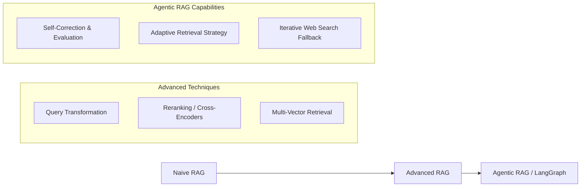

# Complete Retrieval-Augmented Generation (RAG) Architecture & Workflow

## 1. What is RAG?

**Retrieval-Augmented Generation (RAG)** is an architectural pattern and AI framework designed to enhance Large Language Models (LLMs) by grounding their outputs on external, authoritative, dynamic knowledge bases.

Instead of relying solely on parametric memory (facts learned during pre-training), RAG introduces a non-parametric memory component: a searchable document database. When a user submits a query, RAG retrieves relevant facts from this database and passes them to the LLM as context within the prompt.

```
                  ┌──────────────────────┐
                  │ External Documents   │
                  └──────────┬───────────┘
                             │
                             ▼
┌──────────────┐     ┌──────────────┐     ┌──────────────┐     ┌──────────────┐
│ User Query   ├────►│  Retrieval   ├────►│  Augmented   ├────►│ LLM Context  ├────► Final Response
└──────────────┘     │  Mechanism   │     │   Prompt     │     │ Synthesis    │      (Fact-Grounded)
                     └──────────────┘     └──────────────┘     └──────────────┘
```

---

## 2. Core Problems RAG Solves

> [!IMPORTANT]
> Standard LLMs suffer from fundamental limitations when deployed in production enterprise environments. RAG directly addresses these bottlenecks:

1. **Hallucinations**: LLMs generate plausible but factually incorrect statements when missing exact knowledge. RAG restricts LLM synthesis strictly to provided source documents.
2. **Knowledge Cutoff**: Pre-trained models cannot answer questions about events or data after their training date. RAG enables live updates simply by updating the vector index.
3. **Private & Domain-Specific Knowledge**: Confidential enterprise documents, private legal contracts, or customer support knowledge bases cannot be shared with public model training runs. RAG keeps data secure inside your vector store.
4. **Traceability & Citations**: Standard LLM responses are black-box outputs. RAG allows system designers to attach explicit source citations and metadata to every generated answer.

---

## 3. End-to-End RAG Architecture

RAG operates across three core phases: **Ingestion & Indexing**, **Retrieval**, and **Generation**.

```mermaid
flowchart TD
    subgraph Phase 1: Ingestion & Indexing (Offline)
        A[Raw Source Data] --> B[Document Loader]
        B --> C[Text Chunking]
        C --> D[Embedding Model]
        D --> E[(Vector Database)]
    end

    subgraph Phase 2: Retrieval (Query Time)
        F[User Query] --> G[Query Vectorization]
        G --> H[Similarity Search Engine]
        E <-->|Cosine / Dot Product| H
        H --> I[Top-K Relevant Chunks]
    end

    subgraph Phase 3: Generation & Synthesis
        F --> J[Prompt Template]
        I --> J
        J --> K[Large Language Model]
        K --> L[Structured Answer + Citations]
    end
```

---

## 4. Phase-by-Phase Technical Breakdown

### Phase 1: Ingestion & Indexing Pipeline (Offline Setup)

1. **Document Loading**: Extract raw text from heterogeneous sources (PDFs, Markdown, HTML pages, SQL databases, Notion, Confluence).
2. **Text Chunking**: Long documents exceed context windows and dilute embedding quality. Text is divided into smaller, semantically meaningful units (chunks):
   - **Fixed-Size Chunking**: e.g., 500 characters with 50-character overlap.
   - **Recursive Character Chunking**: Splits by paragraphs, lines, and spaces recursively to preserve natural linguistic boundaries.
   - **Semantic Chunking**: Splits text dynamically where semantic similarity drops between consecutive sentences.
3. **Embedding Generation**: Chunks are passed through a dense embedding model (e.g., `text-embedding-3-small`, `bge-large-en-v1.5`) to produce high-dimensional numerical vectors representing semantic meaning.
4. **Vector Storage**: Vectors and original text metadata are stored and indexed in specialized databases (e.g., FAISS, Chroma, Pinecone, Qdrant, Weaviate).

---

### Phase 2: Retrieval Pipeline (Query Time)

1. **Query Embedding**: The user query $q$ is vectorized using the exact same embedding model used during indexing:
   $$\vec{q} = \text{Embed}(q)$$
2. **Similarity Matching**: The vector store compares $\vec{q}$ against indexed document chunk vectors $\vec{d}_i$ using similarity functions:
   - **Cosine Similarity**:
     $$\text{Cosine Similarity}(\vec{q}, \vec{d}_i) = \frac{\vec{q} \cdot \vec{d}_i}{\|\vec{q}\| \|\vec{d}_i\|}$$
   - **Dot Product**:
     $$\text{Dot Product}(\vec{q}, \vec{d}_i) = \vec{q} \cdot \vec{d}_i$$
3. **Top-K Extraction**: The top $K$ chunks with highest similarity scores are retrieved.

---

### Phase 3: Generation & Synthesis (Augmentation)

1. **Prompt Construction**: The retrieved chunks are formatted into an augmented prompt template:
   ```text
   SYSTEM PROMPT:
   You are an expert assistant. Answer the user question using ONLY the provided context.
   If the answer cannot be found in the context, state "I do not have sufficient information."

   CONTEXT CHUNKS:
   ---
   [Source 1]: {Retrieved Chunk 1 Text}
   [Source 2]: {Retrieved Chunk 2 Text}
   ---

   USER QUESTION:
   {User Query}
   ```
2. **LLM Generation**: The prompt is passed to the LLM (e.g., `gpt-4o`, `claude-3-5-sonnet`, `gemini-1.5-pro`) to synthesize a clear, grounded answer with source citations.

---

## 5. Practical Worked Example

### Scenario: IT & Remote Work Policy Query

* **Target Knowledge Base**: *Company Operations Guide 2026*
* **User Question**: *"What is the allowance for home office setup and how often can I claim it?"*

#### Step 1: Chunking & Storage
The document is indexed into chunks:
* **Chunk #42**: *"New full-time staff receive a one-time home office setup allowance of $500 upon joining."*
* **Chunk #43**: *"Annual performance reviews occur every December and dictate salary revisions."*

#### Step 2: Vector Search
The query *"What is the allowance for home office setup and how often can I claim it?"* is embedded and matched.
* $\text{Sim}(\vec{q}, \text{Chunk \#42}) = 0.89$
* $\text{Sim}(\vec{q}, \text{Chunk \#43}) = 0.12$

#### Step 3: Prompt Augmentation & Response
Top retrieved chunk (#42) is injected into the prompt context.

**LLM Response**:
> *"Full-time staff receive a one-time home office setup allowance of $500 upon joining the company."*

---

## 6. Comparative Analysis

| Feature | Base LLM | Fine-Tuned Model | Retrieval-Augmented Generation (RAG) |
| :--- | :--- | :--- | :--- |
| **Primary Knowledge Source** | Pre-training Weights | Fine-Tuning Weights | Live External Vector Database |
| **Knowledge Update Cost** | Exceptionally High | High (Requires Retraining) | Very Low (Re-index target doc) |
| **Hallucination Rate** | High | Moderate | Very Low |
| **Data Privacy & Governance** | Public / Mixed | Baked into model weights | Document/Chunk-Level Access Control |
| **Auditability & Citations** | None | None | Full Lineage & Source Citations |

---

## 7. Advanced RAG & Agentic Paradigms



- **Query Transformation**: Rephrasing or expanding complex queries into multiple sub-queries to maximize retrieval recall.
- **Cross-Encoder Re-ranking**: Passing retrieved top-K vector search candidates through a heavy re-ranker model to ensure high relevance before prompt injection.
- **Agentic RAG (LangGraph)**: Utilizing state machines where autonomous agents evaluate context quality, decide whether to re-query, and dynamically determine when enough information has been gathered to formulate an accurate answer.
