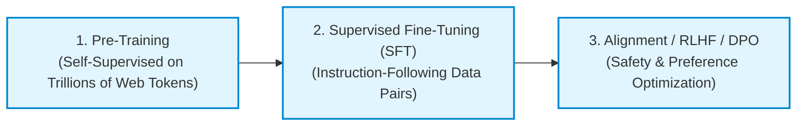
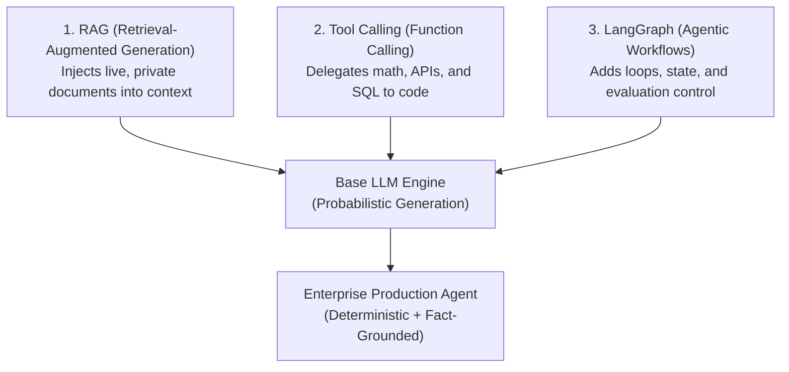

# Large Language Models (LLMs) — Core Theory & Architecture

## 1. What is an LLM?

A **Large Language Model (LLM)** is an advanced Artificial Intelligence model powered by deep neural networks—specifically the **Transformer architecture**—trained on massive textual datasets (trillions of tokens) to understand, process, and generate human language.

At its core, an LLM is a **probabilistic next-token predictor**. Given a sequence of input text (a prompt), the model calculates probability distributions over a vocabulary of sub-word tokens to predict the most statistically likely next token.

```text
Input Prompt: "The capital of France is"
                          │
                          ▼
             ┌─────────────────────────┐
             │   Transformer Core      │
             │  (Attention Mechanism)  │
             └────────────┬────────────┘
                          │
                          ▼
            Probabilities over Vocabulary:
            - "Paris"   -> 98.4%
            - "London"  -> 0.8%
            - "Lyon"    -> 0.3%
                          │
                          ▼
Output Token: "Paris"
```

---

## 2. How LLMs Work Under the Hood

### 1. Tokenization
Before text enters an LLM, it is converted into numerical sub-word units called **tokens** using algorithms like Byte-Pair Encoding (BPE).
- Example: `"Unbelievable"` $\rightarrow$ `["Un", "believ", "able"]` $\rightarrow$ `[3241, 14209, 874]`.

### 2. Dense Embeddings
Token IDs are mapped into continuous vector spaces where words with similar semantic meanings sit closer together in multi-dimensional space:
$$\mathbf{E}(t) \in \mathbb{R}^d$$

### 3. The Transformer Architecture (Self-Attention)
Introduced in the paper *"Attention Is All You Need"* (Vaswani et al., 2017), the **Self-Attention** mechanism allows the model to dynamically compute relations between every pair of words in a sentence regardless of distance:

$$\text{Attention}(Q, K, V) = \text{softmax}\left(\frac{QK^T}{\sqrt{d_k}}\right)V$$

- **$Q$ (Query)**: What the current token is looking for.
- **$K$ (Key)**: What information other tokens hold.
- **$V$ (Value)**: The actual content transmitted if a match occurs.

---

## 3. The 3 Training Phases of Modern LLMs



1. **Pre-Training (Base Model)**: The model reads raw text across the internet to learn language structure, grammar, world facts, and reasoning patterns.
2. **Supervised Fine-Tuning (SFT / Instruct Model)**: The base model is trained on curated `(Instruction, Response)` pairs so it learns to act as a helpful conversational assistant rather than just completing text.
3. **Alignment (RLHF / DPO)**: Reinforcement Learning from Human Feedback ensures outputs are **Helpful, Honest, and Harmless (3 Hs)** while filtering out toxic content.

---

## 4. Strengths vs. Fundamental Limitations

| Dimension | Strengths | Fundamental Limitations |
| :--- | :--- | :--- |
| **Language Understanding** | Exceptional natural language comprehension, translation, & summarization. | Cannot guarantee absolute truth or accuracy. |
| **Reasoning & Code** | High capability in code generation, refactoring, and logical synthesis. | Struggles with precise multi-digit math without execution tools. |
| **Knowledge Access** | Vast general world knowledge from pre-training dataset. | **Knowledge Cutoff**: Blind to data published after training run. |
| **Factuality** | Fast generation of plausible text. | **Hallucinations**: Inventing false facts when missing information. |

---

## 5. Overcoming LLM Bottlenecks: The Modern AI Stack

To transform raw LLMs into reliable enterprise software systems, engineers combine them with three essential techniques:



1. **RAG**: Solves knowledge cutoff and hallucinations by feeding external document chunks into the prompt context.
2. **Tool Calling**: Solves real-time data access and math errors by letting the LLM trigger Python functions or SQL queries.
3. **LangGraph**: Solves single-pass generation limits by placing the LLM inside a state machine loop capable of self-correcting mistakes.
