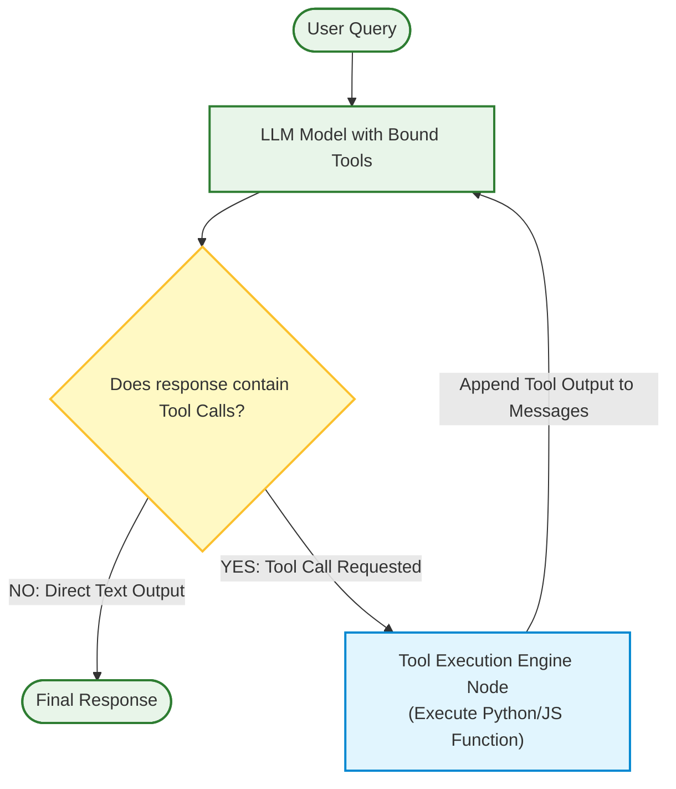
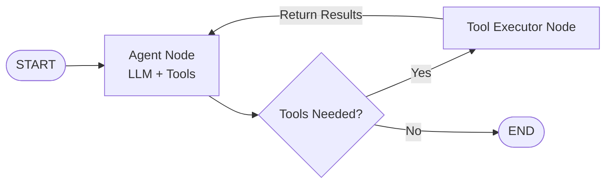

# Tool Calling (Function Calling) & Multi-Tool Agent Orchestration

## 1. What is Tool Calling?

**Tool Calling** (also known as Function Calling) is a technique that enables Large Language Models (LLMs) to detect when external functions, APIs, database queries, or computational tools need to be executed to answer a user request.

Instead of generating text directly, the LLM emits a **structured payload** (typically JSON complying with a defined schema) specifying:
1. **Tool Name**: The function to call (e.g., `search_database`, `calculator`, `fetch_weather`).
2. **Arguments**: The key-value pairs needed by the function (e.g., `{"location": "Tokyo", "unit": "celsius"}`).

The client application (or orchestrator like LangGraph) executes the tool on behalf of the LLM, receives the output, and returns the result back to the LLM to complete its response.

```text
┌──────────────┐          1. Query + Tool Schemas         ┌──────────────┐
│  User Input  ├─────────────────────────────────────────►│     LLM      │
└──────────────┘                                          └──────┬───────┘
                                                                 │
                                          2. Emits Tool Call     │ { name: "get_stock_price",
                                             (JSON Payload)      │   args: { "ticker": "AAPL" } }
                                                                 ▼
┌──────────────┐          4. Return Tool Result           ┌──────────────┐
│     LLM      │◄─────────────────────────────────────────┤  Tool Engine │
└──────┬───────┘                                          │  (Python/JS) │
       │                                                  └──────────────┘
       │ 5. Final Fact-Grounded Response
       ▼
"Apple Inc. (AAPL) is currently trading at $224.50."
```

---

## 2. Why Tool Calling is Essential

> [!IMPORTANT]
> Parametric knowledge in LLMs is static, ungrounded, and incapable of taking actions in the real world. Tool Calling solves these core limitations:

1. **Real-Time Data Access**: LLMs cannot fetch current stock prices, live weather, or recent database records without tools.
2. **Deterministic Calculations**: LLMs struggle with precise multi-digit math or complex logic. Tools delegate math to Python execution environments.
3. **External Action Execution**: Enables agents to send emails, query SQL databases, write files, call webhooks, or interact with external software.
4. **Structured Output**: Forces LLMs to produce validated parameters according to Pydantic/JSON schemas.

---

## 3. Tool Calling Workflow & Sequence Diagram



---

## 4. Tool Calling in LangGraph

In **LangGraph**, tool calling is modeled as a cyclic state machine:



- **Agent Node**: Calls the LLM bound with tools (`llm.bind_tools(tools)`).
- **Tool Node**: Automatically inspects state messages for `tool_calls` and executes corresponding functions.
- **Conditional Edge**: Routes to `tools` node if tool calls are present, otherwise routes to `END`.

---

## 5. Code Examples

### 🐍 Python LangGraph Tool Calling Implementation

```python
import os
from typing import TypedDict, Annotated
from dotenv import load_dotenv

load_dotenv()

from langchain_core.tools import tool
from langchain_openai import ChatOpenAI
from langgraph.graph import StateGraph, START, END
from langgraph.graph.message import add_messages
from langgraph.prebuilt import ToolNode, tools_condition

# 1. Define Tools
@tool
def calculator(a: float, b: float, operation: str) -> str:
    """Perform math calculations. Operations: add, subtract, multiply, divide."""
    if operation == "add":
        return str(a + b)
    elif operation == "multiply":
        return str(a * b)
    return "Unsupported operation"

@tool
def get_weather(city: str) -> str:
    """Get current weather for a specific city."""
    return f"The weather in {city} is 22°C with clear skies."

tools = [calculator, get_weather]

# 2. Define Graph State
class State(TypedDict):
    messages: Annotated[list, add_messages]

# 3. Initialize Model with Tools Bound
llm = ChatOpenAI(model="gpt-4o-mini", temperature=0)
llm_with_tools = llm.bind_tools(tools)

# 4. Define Agent Node Function
def agent_node(state: State):
    response = llm_with_tools.invoke(state["messages"])
    return {"messages": [response]}

# 5. Build LangGraph State Machine
workflow = StateGraph(State)

workflow.add_node("agent", agent_node)
workflow.add_node("tools", ToolNode(tools))

workflow.add_edge(START, "agent")
workflow.add_conditional_edges("agent", tools_condition)
workflow.add_edge("tools", "agent")

app = workflow.compile()

# 6. Execute Tool Calling Agent
if __name__ == "__main__":
    user_input = {"messages": [("user", "What is the weather in Tokyo and what is 15 multiplied by 4?")]}
    output = app.invoke(user_input)
    
    for message in output["messages"]:
        print(f"\n[{message.type.upper()}]: {message.content}")
```

---

### ⚡ TypeScript LangGraph Tool Calling Implementation

```typescript
import { tool } from "@langchain/core/tools";
import { z } from "zod";
import { ChatOpenAI } from "@langchain/openai";
import { StateGraph, Annotation, START, END } from "@langchain/langgraph";
import { ToolNode, toolsCondition } from "@langchain/langgraph/prebuilt";
import { BaseMessage } from "@langchain/core/messages";

// 1. Define Tool Schemas with Zod
const calculatorTool = tool(
  async ({ a, b, operation }) => {
    if (operation === "multiply") return `${a * b}`;
    return `${a + b}`;
  },
  {
    name: "calculator",
    description: "Perform math calculations.",
    schema: z.object({
      a: z.number(),
      b: z.number(),
      operation: z.enum(["add", "multiply"]),
    }),
  }
);

const tools = [calculatorTool];

// 2. Define State Annotation
const GraphState = Annotation.Root({
  messages: Annotation<BaseMessage[]>({
    reducer: (x, y) => x.concat(y),
  }),
});

// 3. Build Tool Calling Graph
const llm = new ChatOpenAI({ modelName: "gpt-4o-mini" }).bindTools(tools);

const workflow = new StateGraph(GraphState)
  .addNode("agent", async (state) => {
    const response = await llm.invoke(state.messages);
    return { messages: [response] };
  })
  .addNode("tools", new ToolNode(tools))
  .addEdge(START, "agent")
  .addConditionalEdges("agent", toolsCondition)
  .addEdge("tools", "agent");

const app = workflow.compile();
```

---

## 6. Tool Calling vs Standard RAG vs Agentic Loops

| Feature | Standard RAG | Function / Tool Calling | Agentic LangGraph |
| :--- | :--- | :--- | :--- |
| **Execution Trigger** | Passive context lookup before prompt | Model autonomously requests tool execution | Dynamic state graph loop with feedback |
| **Data Scope** | Fixed vector store chunks | Live APIs, DB queries, arbitrary code | Multi-tool, multi-step orchestration |
| **Execution Flow** | Deterministic 1-pass chain | 1-2 step tool invocation | Unlimited cyclic loops & self-correction |
